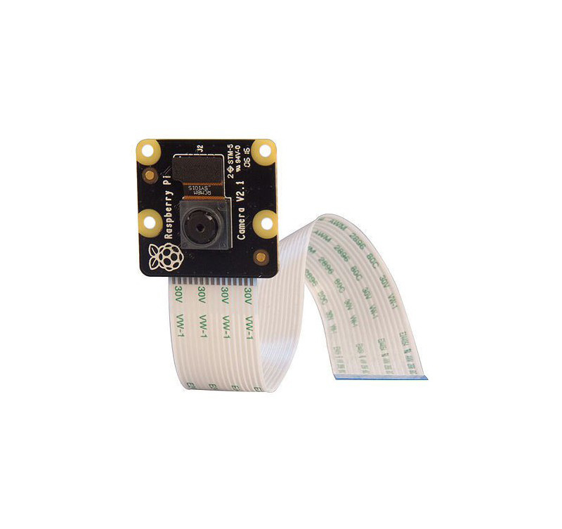

### BabyPi: a Raspberry Pi Babycam
A simple babycam project using the Raspberry Pi with a mounted nightvision camera (IR).

## Hardware

#### The Pi
At the core of this project is a Raspberry Pi Model 3B running Raspbian.

#### Camera module
The camera used is a Raspberry Pi NoIR V2 providing optimal resolution and a Bright Pi infra-red LED lighting module for nightvision.

#### Case and frame
The Pi case used for this project is the Pi-Blox Case that provides a conveniently extensible platform with a fully compatible Lego surface. I have also got hold of some (as much as possible) matching colour selection of other Lego blocks for the base of the camera.

#### White LED and infra-red lighting
The Bright Pi requires a bit of soldering, but it is quite easy to work with.

It is then connected to the Pi via four GPIO pins:

* no. 3 (GPIO 2) Green in picture
* no. 4 (5V POWER) Purple in picture
* no. 5 (GPIO 3) Blue in picture
* no. 6 (GROUND) White in picture

The pins are then connected and soldered to the Bright Pi, such that:

* starting from the socket marked with the black square must be connected to Ground (number 6) (White in picture)
* the second socket from Ground on the Bright Pi must be connected to number 4, the 5V power pin (Purple in picture)
* the third socket counting from Ground connects to number 5, GPIO 3 (Blue in picture)
* finally the last socket, opposite from Ground has to be connected to number 3, GPIO 2 (Green in picture)

 

There are 4 super bright white LEDs on each corner of the panel, and a total of 8 IR LEDs around the middle socket of the Bright Pi which is where the hole is for the camera.

The Bright Pi LED panel is fastened to the camera module using tiny plastic bolts and nuts. I then glued the rear of the camera board to to a Lego block that provides a female Lego connection surface at a 90° angle. This allows me to freely try different prototypes and see whether the camera needs to be able to tilt along any axis.

## Software

The Pi obviously lives and is only used in our home, on our home network. On booting the Pi an init script powers on the IR LEDs and switches them to use full gain. It then initiates the camera feed on a local port which port I then forward to a publicly accessible port on my home router, so our families with access to the address and credentials can also see our boy.
